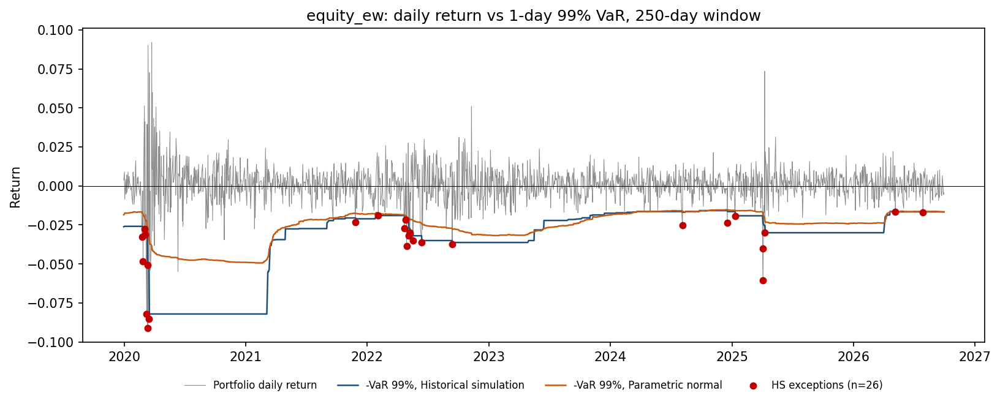
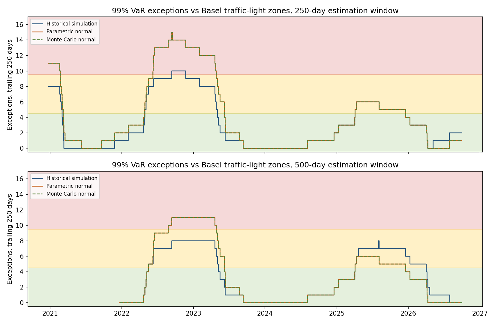
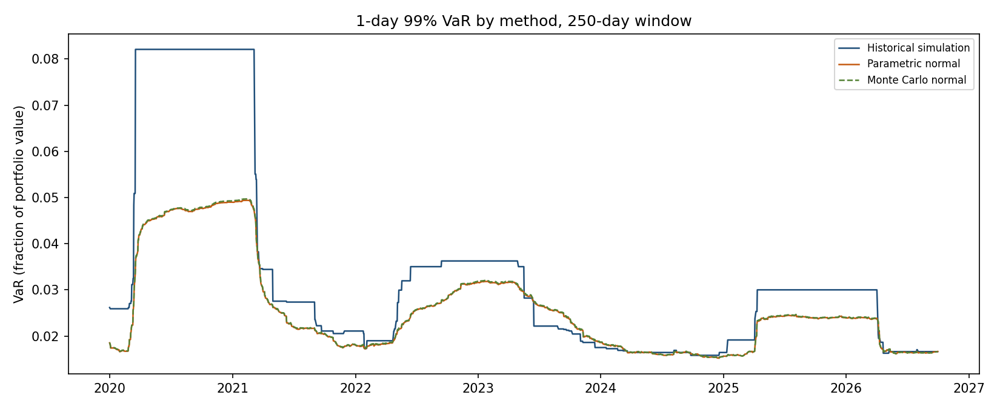

# market-risk-lab

[](https://github.com/narasimhamungi/market-risk-lab/actions/workflows/ci.yml)

Rolling 1-day Value-at-Risk and Expected Shortfall for a fixed-weight equity portfolio, computed three ways (historical simulation, parametric normal, Monte Carlo normal) and backtested with exception counts, the Kupiec test and Basel traffic-light zones. Prices are read from the gold layer of [marketdata-lakehouse](https://github.com/narasimhamungi/marketdata-lakehouse) and results are written back to the same Postgres database. The backtests are reported as they came out, including where the models fail them.

This is a self-initiated applied finance/analytics portfolio project. It is a small prototype built to be checkable. It is not a production risk system and has no connection to any employer, vendor or product.

## Run

Requirements: Python 3.12 or later, and the marketdata-lakehouse gold layer running in Postgres (see that repo for `docker compose up -d postgres` and `build_gold`).

```
pip install -r requirements.txt
python -m market_risk_lab.run
```

That command pulls adjusted closes for the portfolios in `config/portfolios.yaml`, validates them, computes VaR and ES, runs the backtests, writes `risk.risk_results`, runs the rolling-exception SQL and regenerates everything in `outputs/`: `summary.json`, four CSVs and three charts per portfolio.

The connection is read from `MDL_DB_HOST`, `MDL_DB_PORT`, `MDL_DB_NAME`, `MDL_DB_USER` and `MDL_DB_PASSWORD`. The defaults are the local development values published in the lakehouse's `docker-compose.yml`.

The Results section below is not typed. `python -m market_risk_lab.report` renders it from `outputs/`, and CI runs `python -m market_risk_lab.report --check`, which fails if this file and the committed outputs disagree.

### Without the lakehouse

The numbers below depend on that database, so a fresh clone cannot reproduce them on its own. What a fresh clone can do is run the tests:

```
pytest -q
```

The unit tests need nothing else. The integration tests need any Postgres database whose name ends in `_test` (set `MDL_DB_NAME`); they create the three gold tables this project reads, fill them with seeded synthetic prices and run the whole pipeline. They refuse any database without that suffix because they truncate those tables. CI runs both sets on Python 3.12 and 3.14 against Postgres 16.

## Results

<!-- RESULTS:START -->
_Rendered by `python -m market_risk_lab.report` from `outputs/summary.json`: run of 2026-10-04T01:15:36+00:00 on Python 3.14.4. Do not edit by hand._

Settings: estimation windows 250 and 500 days; levels 99% and 97.5%; zero-mean normal methods; 100,000 Monte Carlo draws, seed 20261004.

### Portfolio `equity_ew`

Equal-weight, 8 US large caps, one per GICS sector, rebalanced daily

- Assets: AAPL, JPM, XOM, JNJ, PG, AMZN, CAT, NEE (12.5% each)
- Returns: 1,946 daily, 2019-01-03 to 2026-09-30; mean 0.083%, volatility 1.14% per day
- Data checks: no returns dropped; 50 returns beyond the outlier threshold flagged and kept (vendor reconciliation flag on those prices: single_source 50)
- Rows written to `risk.risk_results`: 18,852

#### Backtest over the full sample

| Method | Window | Level | Forecasts | Exceptions | Expected | Rate | Kupiec p | Kupiec at 5% | Realised loss / predicted ES |
|---|---|---|---|---|---|---|---|---|---|
| Historical simulation | 250 | 99% | 1,696 | 26 | 17.0 | 1.53% | 0.0408 | rejected | 1.15 |
| Parametric normal | 250 | 99% | 1,696 | 33 | 17.0 | 1.95% | 0.0005 | rejected | 1.46 |
| Monte Carlo normal | 250 | 99% | 1,696 | 33 | 17.0 | 1.95% | 0.0005 | rejected | 1.46 |
| Historical simulation | 500 | 99% | 1,446 | 16 | 14.5 | 1.11% | 0.6890 | not rejected | 1.00 |
| Parametric normal | 500 | 99% | 1,446 | 17 | 14.5 | 1.18% | 0.5136 | not rejected | 1.29 |
| Monte Carlo normal | 500 | 99% | 1,446 | 17 | 14.5 | 1.18% | 0.5136 | not rejected | 1.29 |
| Historical simulation | 250 | 97.5% | 1,696 | 49 | 42.4 | 2.89% | 0.3163 | not rejected | 1.08 |
| Parametric normal | 250 | 97.5% | 1,696 | 50 | 42.4 | 2.95% | 0.2502 | not rejected | 1.42 |
| Monte Carlo normal | 250 | 97.5% | 1,696 | 51 | 42.4 | 3.01% | 0.1947 | not rejected | 1.41 |
| Historical simulation | 500 | 97.5% | 1,446 | 27 | 36.1 | 1.87% | 0.1069 | not rejected | 1.06 |
| Parametric normal | 500 | 97.5% | 1,446 | 29 | 36.1 | 2.01% | 0.2125 | not rejected | 1.24 |
| Monte Carlo normal | 500 | 97.5% | 1,446 | 29 | 36.1 | 2.01% | 0.2125 | not rejected | 1.24 |

The last column is the mean realised loss on exception days divided by the mean ES predicted for those days at the same level. Above 1 means the tail was worse than the model said.

#### Basel traffic light (99% VaR, exceptions in the trailing 250 forecasts)

| Method | Estimation window | 250-day windows | Green | Yellow | Red | Worst count | Latest zone |
|---|---|---|---|---|---|---|---|
| Historical simulation | 250 | 1,447 | 67.0% | 29.4% | 3.5% | 10 | green |
| Parametric normal | 250 | 1,447 | 64.8% | 17.2% | 18.0% | 15 | green |
| Monte Carlo normal | 250 | 1,447 | 64.8% | 17.2% | 18.0% | 15 | green |
| Historical simulation | 500 | 1,197 | 58.9% | 41.1% | 0.0% | 8 | green |
| Parametric normal | 500 | 1,197 | 62.9% | 23.1% | 14.0% | 11 | green |
| Monte Carlo normal | 500 | 1,197 | 62.9% | 23.1% | 14.0% | 11 | green |

#### Reading the tables

- Kupiec at 5% on 99% VaR: rejected for historical simulation (250-day), parametric normal (250-day) and Monte Carlo normal (250-day); not rejected for historical simulation (500-day), parametric normal (500-day) and Monte Carlo normal (500-day).
- Red zone (10 or more exceptions in 250 days), share of days and worst count: historical simulation (250-day) 3.5%, 10; parametric normal (250-day) 18.0%, 15; Monte Carlo normal (250-day) 18.0%, 15; parametric normal (500-day) 14.0%, 11; Monte Carlo normal (500-day) 14.0%, 11. Never reached by historical simulation (500-day).
- Realised loss on exception days relative to predicted ES at 97.5%: historical simulation 1.06 to 1.08; parametric normal 1.24 to 1.42; Monte Carlo normal 1.24 to 1.41.
- Monte Carlo against parametric: largest relative gap 1.01% in VaR and 0.67% in ES across all dates, with 100,000 draws.

#### Vectorised against one-date-at-a-time

| Method | Window | Forecasts | Vectorised (ms) | Loop (ms) | Speedup | Largest difference |
|---|---|---|---|---|---|---|
| Historical simulation | 250 | 1,696 | 3.5 | 169.1 | 48x | 0.0e+00 |
| Parametric normal | 250 | 1,696 | 22.8 | 629.6 | 28x | 2.1e-17 |
| Historical simulation | 500 | 1,446 | 5.5 | 148.5 | 27x | 0.0e+00 |
| Parametric normal | 500 | 1,446 | 37.7 | 506.7 | 13x | 2.1e-17 |

13x to 48x on the machine that produced this run. Timings are machine-dependent; the equality of the two outputs is not.






<!-- RESULTS:END -->

### Interpretation

This paragraph is inference. Nothing in the repo tests it.

All three methods weight every day in the window equally, so they adapt slowly when volatility changes. Losses then exceed VaR several times in quick succession before the window catches up, and VaR stays high for a full window length after the shock has gone, which is the flat plateau visible in the historical-simulation line. That is the usual explanation for exceptions arriving in clusters, and for a model passing a frequency test over the full sample while spending long stretches in the yellow or red zone. Confirming it here would take an independence test and a volatility-weighted method, neither of which is built.

## Methodology

**Conventions.** Simple returns. Portfolio return is fixed weights times asset returns, which means the portfolio is reset to its target weights every day. Loss is minus return. VaR and ES are positive numbers, as fractions of portfolio value. The forecast for day t uses the W returns before day t and is compared with the return on day t; a test perturbs the return on day t and requires the forecast for day t to be unchanged.

**Historical simulation.** VaR at level α is the smallest loss in the window whose empirical distribution function reaches α, which is order statistic ⌈Wα⌉ of the window's portfolio losses. ES is the exact average of the worst (1 − α) share of the window, including the fractional weight on the boundary observation, so ES is never below VaR at the same level.

**Parametric normal.** Rolling sample covariance of asset returns, portfolio volatility σ = √(w′Σw), VaR = zσ and ES = σφ(z)/(1 − α). The mean is set to zero by default; the covariance stays centred.

**Monte Carlo normal.** Seeded draws from a multivariate normal with the same rolling covariance, with the same draws reused on every date so that day-to-day changes are not simulation noise. For a linear portfolio under normality this converges to the parametric result. It is kept as a check on the covariance plumbing and as the place where non-linear positions or non-normal draws would go. It is not an independent model, and the Results section reports how far it sits from the parametric numbers.

**Vectorisation.** Windows are built with `numpy.lib.stride_tricks.sliding_window_view`. Historical simulation and parametric have no loop over dates. Monte Carlo processes dates in fixed-size blocks to bound memory. `naive.py` holds one-date-at-a-time versions built on `np.quantile` and `np.cov`; the tests require the two implementations to agree and the benchmark times them against each other.

**Backtests.**
- An exception is a day whose loss is strictly greater than that day's VaR.
- Kupiec proportion-of-failures test: likelihood ratio of the observed exception rate against the nominal one, compared with χ²(1).
- Basel traffic light on the higher VaR level: exceptions in the trailing 250 forecasts, green for 0 to 4, yellow for 5 to 9, red for 10 or more. The count is computed in NumPy and again by a SQL window function over `risk.risk_results`; the run aborts if they differ.
- ES check: mean realised loss on exception days divided by the mean ES predicted for those days.

**Data validation.** The run aborts, naming the check, on a missing ticker, more than one row per ticker and date, a non-positive price, a price on a date the lakehouse does not mark as a trading day, too many missing prices, a run of unchanged prices, or too short a history. A return that touches a missing price or spans a calendar gap is dropped and logged. Prices are never filled. Returns beyond the configured threshold (five standard deviations by default) are flagged with the lakehouse's vendor-reconciliation flag and kept, because removing tail days from a risk model's input understates risk. Everything is written to `outputs/<portfolio>_data_validation.csv`.

**Results store.** `risk.risk_results` has one row per date, portfolio, method, window and level. Check constraints enforce ES ≥ VaR and that the exception flag agrees with the sign convention. A re-run replaces a portfolio's rows in one transaction.

## Limitations

**Model**
- Fixed weights reset daily is an assumption, not a description of a real book: no drift, no transaction costs.
- One asset class (US large-cap equity) and one horizon (1 day). No square-root-of-time scaling, no liquidity horizons, no options or other non-linear positions.
- Equal-weighted windows only. No volatility weighting such as EWMA or filtered historical simulation.
- Two of the three methods assume normality, and the Monte Carlo method adds no information beyond the parametric one for this portfolio.
- Historical simulation estimates the tail from very few points: at the higher level and the shorter window, VaR rests on about three observations.
- The zero-mean setting ignores drift.

**Backtest**
- Kupiec tests exception frequency only. There is no independence test (Christoffersen), so clustering is visible in the charts but not tested.
- Exception counts are small, and Kupiec has low power at this sample size. A non-rejection is weak evidence that a model is right.
- Every method, window and level is backtested, with no adjustment for multiple testing.
- The traffic light here uses hypothetical P&L on fixed weights and is evaluated on every day's trailing window. Consecutive windows overlap almost entirely, so the zone shares describe the history; they are not independent tests and not the regulatory quarterly process.
- The ES column is a sanity check on a handful of days, not a formal ES backtest.

**Data**
- Free sources, with yfinance as the primary one. Adjusted closes are restated when later dividends and splits are applied, so a re-run after the lakehouse reloads can move the numbers. The committed outputs carry their run time.
- The lakehouse's two-vendor reconciliation covers only a sample of tickers. The Results section shows which reconciliation flag the flagged prices carry.
- The tickers were chosen in 2026 from current S&P 500 members, one large company per sector. That is selection with hindsight: each daily forecast is still out of sample, but the level of risk and the mean return are flattered.
- Only the current `dim_security` key is read for each ticker, so a company that has left the index cannot be used.
- The lakehouse derives its trading calendar from the prices themselves, so a day missing for the whole universe is only caught by the calendar-gap check.

**Engineering**
- Results cannot be reproduced without the lakehouse database.
- The benchmark covers historical simulation and parametric only, times the loop version once against the best of three vectorised runs, and depends on the machine.
- The default database credentials in `store.py` are the lakehouse's local development defaults. Override them with environment variables anywhere else.
- No scheduling, monitoring, access control or audit trail.

## Project structure

```
config/portfolios.yaml        portfolios, windows, levels, validation thresholds
src/market_risk_lab/
  data.py                     price pull, validation, simple returns
  portfolio.py                weights from YAML, portfolio return
  risk.py                     vectorised rolling VaR and ES, three methods
  naive.py                    one-date-at-a-time reference implementations
  backtest.py                 exceptions, Kupiec, traffic light, ES check
  store.py                    Postgres connection, results table, rolling-exception query
  benchmark.py                vectorised against loop timing
  charts.py                   three charts
  run.py                      the one command
  report.py                   renders the Results section of this file
  sql/                        price query, calendar query, results DDL, window-function query
tests/                        unit tests, Postgres integration tests, gold-schema fixture
docs/FEATURE_SPEC.md          one-page product requirement for the same feature
outputs/                      generated by run.py and committed
```

## Licence

MIT. See `LICENSE`.
